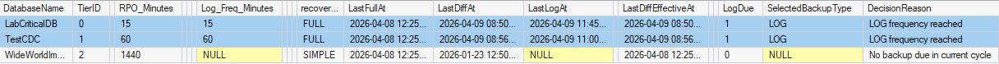

<a href="../README.md">Home</a> |
<a href="scheduler-behavior.md">Back</a>

# Scenario 2 — LOG Backup Due
### Transaction log frequency has been exceeded.

### 🔍 Evidence
Decision matrix showing:
  - `LogDue = 1`
  - `SelectedBackupType = LOG`
  - `DecisionReason = 'LOG frequency reached'`

  

### Interpretation
  - LOG backups are triggered precisely when required
  - Frequency is respected per Tier configuration
  - RPO enforcement is consistent
